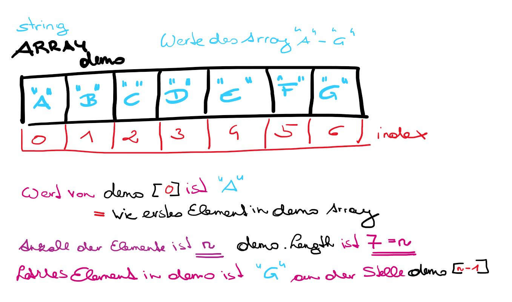

# Wald & Wiese: Eindimensionaler Array

Hier wird erklärt was ein eindimensionalen Array ist. 
Dezidiert wird auf die Verwendung in C# Unity eingegangen. 

Was ist ein Array?
Ein Array (de: Anordnung/Aufstellung) ist eine Datenstruktur die es erlaubt 
in einer Variable mehrere Objekte gleichen Datentyps (Elementtyp des Arrays) zu speichern. 
Auf die Reihe von Variablen wird über berechnete Indizes zugegriffen.
Man kann sich das vorstellen wie eine Liste.
Wichtig dabei: Die Größe des Arrays muss vorab bekannt sein und ist unabänderbar! 

Was ist ein eindimensionaler Array? 
Ein Array mit dem Rang eins wird als "eindimensionales" Array bezeichnet. Ein Array mit einem Rang
größer als eins wird als "mehrdimensionals" Array bezeichnet. 
Ein Array verfügt über einen Rang, der die Anzahl der Indizes bestimmt, 
die mit jedem Array Element verknüpft sind. 
Der Rang eines Arrays wird auch als Dimensionen des Arrays bezeichnet.

## Wie können wir uns diese Datenstruktur vorstellen?

## Die Größe des Arrays muss vorab bekannt sein! 
Ein Array hat einen statischer Charakter, d.h. nicht einfach erweiterbar. Dafür ist der Datenzugriff sehr schnell. 
Wichtig in C# der Array muss initialisiert sein!

## Anzahl der Elemente im Array?
Die Anzahl der Elemente eines Arrays ist **n**.

## Zugriff auf die Elemente im Array?
Es sei ein Array mit n Elementen gegeben. D.h. der Index fängt bei 0 an und endet bei n-1.

## Beispiele: 
In ExampleArrays.cs finden sich Beispiele für Deklaration, 
Initialiserung, Zugriff erstes Element, Zugriff letztes Element, Durchlaufen eines Arrays

Im folgenden sind Aufgaben gestellt zur Übung; in PracticeArrays.cs sind Lösungsansätze zu finden. 

-------------------------------------------------------------------------------------
//Deklaration eines Arrays namens array vom Datentyp int

-------------------------------------------------------------------------------------

//Deklaration von array1, array2, array3. array4 und deren Initialiserung auf 3 unterschiedliche Arten:

// -- array1 Datentyp int, 4 Elemente

// -- array2 Datentyp int, 4 Elemente, Werte 21,22,23,24

// -- array3 Datentyp int, 7 Elemente, Werte 31-37

// -- array4 Datentyp string, 10 Elemente, Werte "array4"

// -- arrayColoredImagesRed Datentyp GameObject mittels GameObject.FindGameObjectsWithTag("RedImage"); dabei ist natürlich
Voraussetzung, dass die Images im 2D Unity Projekt angelegt sind (4 Elemente) und das Tag RedImage jeweils ausgewählt ist. 

-------------------------------------------------------------------------------------

//Direkter Zugriff auf einzelne Elemente in den Arrays array1-array4 und arrayColoredImageRed

// 1) auf erstes Element -- Jeweils ein Debug.Log ausgeben. Beim arrayColoredImageRed den Namen des Objektes ausgeben.

// 2) auf letzes Element -- Jeweils ein Debug.Log ausgeben. Beim arrayColoredImageRed den Namen des Objektes ausgeben.

-------------------------------------------------------------------------------------

//Zugriff auf einen Array mittels For-Schleife. Eine For-Schleife führt eine Operation mehrmals aus.

//Hier wird immer wieder der Wert der Elemente als string im Array in einem Debug.Log ausgegeben. 

//1) Eine Methode schreiben die die Werte mit zugehörigen index als Debug.Log ausgibt.

//   Element[0] = Wert an 0

//   Element[1] = Wert an 1

//   ....

//2) Eine Methode schreiben die die Werte des Arrays als einen langen string ausgibt, z.b. 1 2 3 4 statt 

//   1

//	 2

//   3

//   4

-------------------------------------------------------------------------------------

//Array Zugriff einzelne Elemente: 

//Greifen Sie auf das 4te Elemente in array1 zu und ändern sie den Wert auf 3. Geben Sie das Element mittels Debug.Log aus

//Greifen Sie auf das 3te Element in array2 zu und ändern sie den Wert auf 203. Geben Sie das Element mittels Debug.Log aus

//Greifen Sie auf das 6te Element in array3 zu und ändern sie die Farbe auf 333. 

//Greifen Sie auf das 3te Element in array4 zu und ändern sie den Wert auf "heute". Geben Sie das Element mittels Debug.Log aus

//Greifen Sie auf das 3te Element in arrayColoredImagesRed zu und ändern sie die Farbe auf grün. Die Änderung sollte in der Scene/Game View ersichtlich sein 

-------------------------------------------------------------------------------------

//Weitere Beispiele: 

//Erstelle ein weiteres Array mit Namen array5, dass mit allen geraden Zahlen zwischen 20 und 70 gefüllt ist. 

//Gefordert ist ein Array mit Namen array6, dass alle geraden Zahlen zwischen 0 und 500 enthält.

//Gefordert ist ein Array mit Namen array7, dass alle ungeraden Zahlen zwischen 0 und 500 enthält.

//Gefordert ist ein Array mit Namen array8, dass 100 Elemente hält und als Elemente folgende Buchstabenreihe hat: "a", "b", "a", "b","a", "b","a", "b", ...

//Gefordert ist ein Array mit Namen array9, mit 1000 Elementen. Die Elemente werden mit Randomzahlen gefüllt und ausgegeben über Debug.

//Das array9 einhält unsortierte int Werte. Sortiere das Array und gib mittels Debug.Log die Werte des sortierten array9 aus. HINT: Hier wird System.Array.Sort() verwendet!!   

//Erweitern des Array durch zusammenkopieren von 2 Arrays. Kopiere array5 und arry6 in ein neues array10

//Gefordert ist ein Array mit Namen array11, mit 1000 Elementen. Die Elemente werden mit Randomzahlen gefüllt, ermittle das Minimum und Maximum der enthaltenen Werte. 

//Gefordert ist ein Array mit Namen array12, mit 1000 Elementen. Die Elemente werden mit Randomzahlen gefüllt. Suche einen Wert und gib den Index retour, Hint: System.Array nachschauen!

//optional: Histogram: Gefordert ist ein Array mit Namen array12. Die Elemente werden mit Randomzahlen gefüllt zwischen 1 und 5. Ermittle wie oft 1, 2, 3, 4, 5 vorkommt und speichere die Anzahl in einem Array namens histogram. Das Array histogram hat 5 Elemente.

## Fragen:
Macht es einen Unterschied ein Array über den Inspector zu initialisieren oder im Script?
Was passiert mit der Initialisierung von Arrays wenn fälschlicherweise das Script 2x attached wurde?

### Development platform: 
Windows 10; Unity 2020.1.5f1; 

### Target platform: 
WebGL 960 x 600

### Visuals: 

### Necessary setup/execution steps: 
None

### Third party material: 
None

### Project state: 
incl. progress in percent

### Lessons Learned: 
Array handling

Copyright by smeerws

